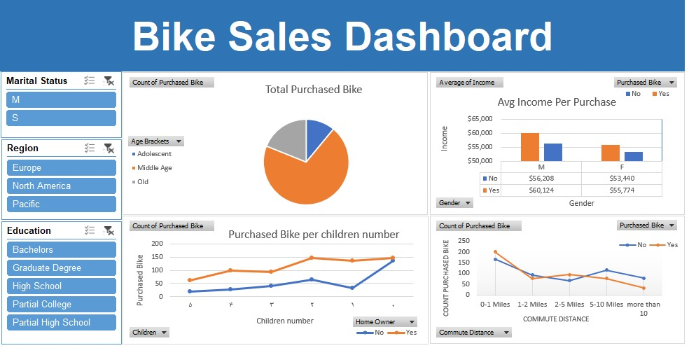

# Bike Sales Dashboard

This project features a dashboard designed to analyze bike sales data based on various customer demographics.

## Overview

The dashboard provides insights into:

- **Total Purchased Bikes** (pie chart view)
- **Average Income Per Purchase** segmented by Gender
- **Bike Purchases by Number of Children**
- **Bike Purchases by Commute Distance**
- Customer filters based on:
  - **Marital Status**
  - **Region**
  - **Education Level**
  - **Age Bracket**

## Dashboard Preview

## Files

- `BikeSalesDashboard.pbix` — The Power BI dashboard file.

---
